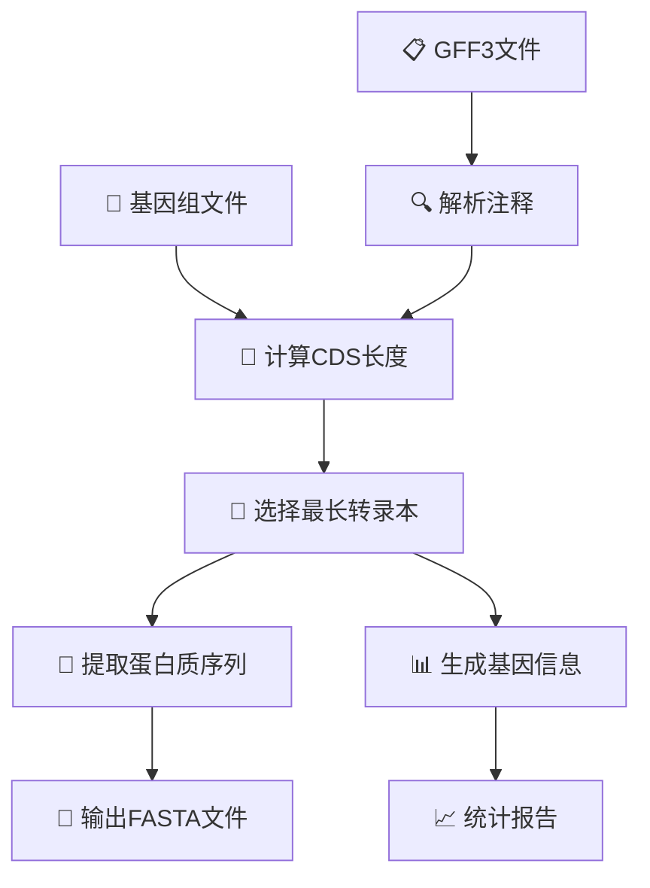

# 🧬 最长转录本提取工具 | Longest mRNA Extraction Tool

[](https://www.python.org/)
[](LICENSE)
[](https://github.com/biopytools)

## 📋 目录 | Table of Contents

- [🎯 项目介绍](#-项目介绍--project-introduction)
- [✨ 功能特点](#-功能特点--features)
- [🛠️ 安装说明](#️-安装说明--installation)
- [🚀 快速开始](#-快速开始--quick-start)
- [📖 详细用法](#-详细用法--detailed-usage)
- [📁 输入文件格式](#-输入文件格式--input-file-formats)
- [📄 输出文件格式](#-输出文件格式--output-file-formats)
- [💡 使用示例](#-使用示例--examples)
- [⚠️ 注意事项](#️-注意事项--notes)
- [🔧 故障排除](#-故障排除--troubleshooting)
- [📦 依赖项](#-依赖项--dependencies)
- [🤝 贡献指南](#-贡献指南--contributing)
- [📜 许可证](#-许可证--license)

## 🎯 项目介绍 | Project Introduction

**最长转录本提取工具**是一个专门用于从基因组序列和GFF3注释文件中提取每个基因的最长转录本对应蛋白质序列的生物信息学工具。该工具采用模块化设计，能够自动分析所有转录本的CDS长度，智能选择最长的转录本进行序列提取。

🔬 **适用领域**：
- 基因组学研究
- 转录组学分析
- 蛋白质组学预研究
- 比较基因组学
- 进化生物学研究

## ✨ 功能特点 | Features

### 🤖 智能化处理
- **自动识别**：智能识别每个基因的最长转录本
- **CDS计算**：基于CDS长度精确计算，确保编码序列完整性
- **批量处理**：支持大规模基因组数据的批量处理

### 📊 数据管理
- **详细统计**：生成基因信息、转录本统计等详细报告
- **格式兼容**：支持标准GFF3格式注释文件
- **质量保证**：输出标准FASTA格式蛋白质序列

### 🔧 技术特色
- **模块化设计**：易于维护和扩展的代码架构
- **错误处理**：完善的异常处理和日志记录系统
- **跨平台**：支持Linux、macOS、Windows系统

## 🛠️ 安装说明 | Installation

### 📋 系统要求
- Python 3.7 或更高版本
- 至少 4GB RAM（推荐 8GB+）
- 足够的磁盘空间存储输出文件

### 📦 依赖软件
```bash
# 安装必需的生物信息学工具
conda install -c bioconda gffread seqkit

# 或使用其他包管理器
# Ubuntu/Debian
sudo apt-get install gffread seqkit

# macOS (Homebrew)
brew install gffread seqkit
```

### 🐍 Python包安装
```bash
# 克隆仓库
git clone https://github.com/your-username/longest-mrna-extractor.git
cd longest-mrna-extractor

# 安装依赖
pip install -r requirements.txt

# 安装工具
pip install -e .
```

## 🚀 快速开始 | Quick Start

### 🎯 基本用法
```bash
# 最简单的使用方式
biopytools longest-mrna \\
    -g genome.fasta \\
    -f annotation.gff3 \\
    -o longest_proteins.fasta
```

### 📊 包含基因信息输出
```bash
# 生成详细的基因信息文件
biopytools longest-mrna \\
    --genome genome.fasta \\
    --gff3 annotation.gff3 \\
    --output proteins.fasta \\
    --gene-info gene_details.tsv
```

## 📖 详细用法 | Detailed Usage

### 🎛️ 命令行参数
```bash
biopytools longest-mrna [OPTIONS]
```

| 参数 | 简写 | 类型 | 必需 | 描述 |
|------|------|------|------|------|
| `--genome` | `-g` | PATH | ✅ | 📁 输入基因组FASTA文件 |
| `--gff3` | `-f` | PATH | ✅ | 📋 输入GFF3注释文件 |
| `--output` | `-o` | PATH | ✅ | 📄 输出FASTA文件 |
| `--gene-info` | | PATH | ❌ | 📊 基因信息输出文件 (可选) |
| `--help` | `-h` | | ❌ | 💡 显示帮助信息 |

### ⚙️ 处理流程 | Processing Pipeline



## 📁 输入文件格式 | Input File Formats

### 🧬 基因组FASTA文件
```fasta
>chr1
ATCGATCGATCGATCGATCGATCG...
>chr2
GCTAGCTAGCTAGCTAGCTAGCTA...
```

**要求**：
- ✅ 标准FASTA格式
- 🏷️ 序列ID必须与GFF3文件中的seqid匹配
- 📚 支持多染色体/scaffold
- 🎯 建议使用标准命名规范

### 📋 GFF3注释文件
```gff3
##gff-version 3
chr1	source	gene	1000	5000	.	+	.	ID=gene001;Name=GENE001
chr1	source	mRNA	1000	5000	.	+	.	ID=transcript001;Parent=gene001
chr1	source	CDS	1200	2000	.	+	0	Parent=transcript001
chr1	source	CDS	3000	4000	.	+	0	Parent=transcript001
```

**要求**：
- ✅ 符合GFF3标准格式
- 🔗 正确的Parent-Child关系
- 📏 完整的CDS坐标信息
- 🏷️ 包含gene、mRNA、CDS等特征类型

## 📄 输出文件格式 | Output File Formats

### 🧪 蛋白质序列文件 (FASTA)
```fasta
>gene001|transcript001|1524
MATLQKIESTVSGQVNLILKPNMCYTQGDVTCKPGTHFTVILK...
>gene002|transcript003|2100
MSELFKQKNVHIVDVQKGFKERMQKTADTLWNIQKSLPGGVSK...
```

**格式说明**：
- 🏷️ 序列头：`>基因ID|转录本ID|CDS长度`
- 🧪 序列内容：翻译后的蛋白质序列
- 📏 长度信息：CDS的碱基对总长度

### 📊 基因信息文件 (TSV)
```tsv
mRNA_ID	gene_ID	mRNA_start	mRNA_end	gene_start	gene_end	strand	chr
transcript001	gene001	1000	5000	1000	5000	+	chr1
transcript003	gene002	6000	9000	6000	9000	-	chr1
```

**字段说明**：
- 🧬 `mRNA_ID`：选择的最长转录本ID
- 🎯 `gene_ID`：对应的基因ID
- 📏 `mRNA_start/end`：转录本起止位置
- 🧬 `gene_start/end`：基因起止位置
- ➡️ `strand`：链方向 (+/-)
- 🏷️ `chr`：染色体/scaffold名称

## 💡 使用示例 | Examples

### 🚀 示例1：基本提取
```bash
# 从拟南芥基因组中提取最长转录本
biopytools longest-mrna \\
    -g Arabidopsis_thaliana.TAIR10.dna.toplevel.fa \\
    -f Arabidopsis_thaliana.TAIR10.55.gff3 \\
    -o arabidopsis_longest_proteins.fasta
```

### 🔧 示例2：完整分析
```bash
# 包含详细基因信息的完整分析
biopytools longest-mrna \\
    --genome rice_genome.fasta \\
    --gff3 rice_annotation.gff3 \\
    --output rice_proteins.fasta \\
    --gene-info rice_gene_details.tsv
```

### 🏗️ 示例3：大规模数据处理
```bash
# 处理大型真核基因组
biopytools longest-mrna \\
    -g human_genome_hg38.fasta \\
    -f gencode.v42.annotation.gff3 \\
    -o human_longest_proteins.fasta \\
    --gene-info human_gene_summary.txt
```

### 📊 示例4：批处理脚本
```bash
#!/bin/bash
# 批量处理多个物种

species=("arabidopsis" "rice" "maize")
for sp in "${species[@]}"; do
    echo "🚀 Processing $sp..."
    biopytools longest-mrna \\
        -g data/${sp}_genome.fasta \\
        -f data/${sp}_annotation.gff3 \\
        -o results/${sp}_proteins.fasta \\
        --gene-info results/${sp}_gene_info.tsv
    echo "✅ $sp completed!"
done
```

## ⚠️ 注意事项 | Notes

### 🔍 数据质量要求
- **完整性检查**：确保GFF3文件包含完整的基因结构信息
- **格式验证**：使用标准GFF3验证工具检查文件格式
- **坐标一致性**：基因组文件与注释文件必须来自同一版本

### 🎯 算法说明
- **选择标准**：基于CDS总长度选择最长转录本
- **并列处理**：多个转录本CDS长度相同时，选择第一个出现的
- **过滤机制**：只处理具有完整CDS信息的转录本

### 💾 性能考虑
- **内存使用**：大基因组文件建议至少8GB RAM
- **磁盘空间**：输出文件大小约为输入基因组的10-30%
- **处理时间**：取决于基因组大小和转录本数量

## 🔧 故障排除 | Troubleshooting

### ❌ 常见错误及解决方案

#### 1. 文件不存在错误
```bash
FileNotFoundError: [Errno 2] No such file or directory
```
**解决方案**：
- ✅ 检查文件路径是否正确
- 📁 确认文件存在且有读取权限
- 🔗 使用绝对路径避免相对路径问题

#### 2. GFF3格式错误
```bash
GFF3 parsing error: Invalid format
```
**解决方案**：
- 📋 使用GFF3验证工具检查格式
- 🔧 确保包含必需的特征类型（gene, mRNA, CDS）
- 🔗 检查Parent-Child关系是否正确

#### 3. 内存不足错误
```bash
MemoryError: Unable to allocate memory
```
**解决方案**：
- 💾 增加系统内存或使用交换空间
- 📊 分批处理大型基因组文件
- 🗂️ 清理临时文件释放磁盘空间

#### 4. 依赖软件未找到
```bash
Command 'gffread' not found
```
**解决方案**：
- 📦 安装缺失的生物信息学工具
- 🔧 确保工具在系统PATH中
- 🐍 使用conda环境管理依赖

### 🐛 调试技巧
```bash
# 启用详细日志
export PYTHONPATH=/path/to/longest-mrna-extractor:$PYTHONPATH
python -m longest_mrna.main --help

# 检查中间文件
ls -la /tmp/longest_mrna_*

# 验证输出格式
head -20 output_proteins.fasta
```

## 📦 依赖项 | Dependencies

### 🐍 Python包
```txt
click>=8.0.0
biopython>=1.79
pandas>=1.3.0
```

### 🔬 生物信息学工具
- **gffread** (>= 0.12.0) - GFF文件处理和序列提取
- **seqkit** (>= 2.0.0) - FASTA序列操作工具

### 📋 安装检查
```bash
# 检查Python环境
python --version  # >= 3.7

# 检查必需工具
gffread --version
seqkit version

# 检查Python包
pip list | grep -E "(click|biopython|pandas)"
```

## 🤝 贡献指南 | Contributing

我们欢迎社区贡献！🎉

### 🚀 快速贡献
1. 🍴 Fork 本仓库
2. 🌟 创建特性分支 (`git checkout -b feature/amazing-feature`)
3. 💻 提交更改 (`git commit -m 'Add amazing feature'`)
4. 📤 推送分支 (`git push origin feature/amazing-feature`)
5. 🔄 创建 Pull Request

### 🐛 报告问题
- 📋 使用 GitHub Issues 报告bug
- 🔍 提供详细的错误信息和复现步骤
- 📊 包含系统环境和版本信息

### 💡 功能建议
- 🌟 在 Issues 中描述新功能需求
- 🎯 说明使用场景和预期效果
- 🤝 参与讨论和设计

## 📜 许可证 | License

本项目采用 MIT 许可证 - 详见 [LICENSE](LICENSE) 文件。

---

## 📞 联系方式 | Contact

- 📧 邮箱：[your-email@example.com](mailto:your-email@example.com)
- 🐙 GitHub：[https://github.com/your-username/longest-mrna-extractor](https://github.com/your-username/longest-mrna-extractor)
- 📚 文档：[https://longest-mrna-extractor.readthedocs.io](https://longest-mrna-extractor.readthedocs.io)

## 🙏 致谢 | Acknowledgments

- 🔬 感谢生物信息学社区的支持
- 🛠️ 感谢 gffread 和 seqkit 工具的开发者
- 👥 感谢所有贡献者和用户的反馈

---

<div align="center">
  <p>🧬 Made with ❤️ for the bioinformatics community</p>
  <p>⭐ 如果这个工具对你有帮助，请给个星标！</p>
</div>