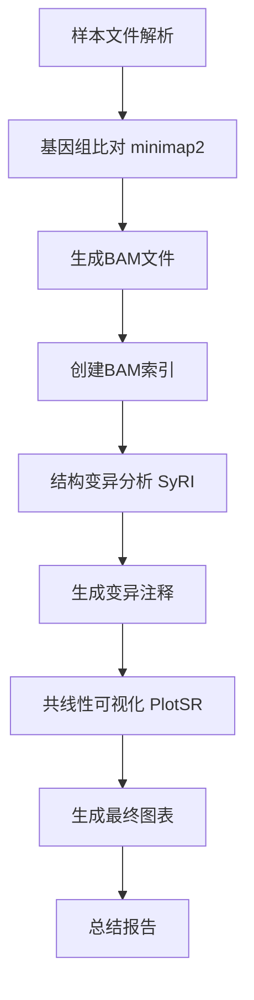

# 基因组共线性可视化工具 | Genome Collinearity Visualization Tool

[](https://www.python.org/)
[](LICENSE)
[]()

一个基于 minimap2、syri 和 plotsr 的模块化基因组共线性可视化分析工具。

A modular genome collinearity visualization analysis tool based on minimap2, syri, and plotsr.

---

## 📋 目录 | Table of Contents

- [功能特点 | Features](#功能特点--features)
- [依赖软件 | Dependencies](#依赖软件--dependencies)
- [安装 | Installation](#安装--installation)
- [快速开始 | Quick Start](#快速开始--quick-start)
- [详细使用 | Detailed Usage](#详细使用--detailed-usage)
- [输入文件格式 | Input File Format](#输入文件格式--input-file-format)
- [输出结果 | Output Results](#输出结果--output-results)
- [参数详解 | Parameter Details](#参数详解--parameter-details)
- [使用示例 | Examples](#使用示例--examples)
- [常见问题 | FAQ](#常见问题--faq)
- [技术细节 | Technical Details](#技术细节--technical-details)

---

## 🚀 功能特点 | Features

### 核心功能 | Core Functions
- **多基因组比对 | Multi-genome Alignment**: 使用 minimap2 进行高质量基因组间比对
- **结构变异检测 | Structural Variation Detection**: 通过 syri 识别基因组间的结构变异
- **共线性可视化 | Collinearity Visualization**: 利用 plotsr 生成高质量的共线性图表
- **染色体特异性分析 | Chromosome-specific Analysis**: 支持指定染色体的精细化分析

### 设计特点 | Design Features
- **模块化架构 | Modular Architecture**: 清晰的代码结构，易于维护和扩展
- **灵活的输入格式 | Flexible Input Format**: 支持制表符和空格分隔的样本文件
- **完整的错误处理 | Comprehensive Error Handling**: 详细的错误信息和日志记录
- **可定制的可视化 | Customizable Visualization**: 多种图像格式和参数选项

---

## 📦 依赖软件 | Dependencies

### 必需软件 | Required Software

| 软件 | 版本要求 | 用途 | 安装方式 |
|------|----------|------|----------|
| **minimap2** | ≥2.17 | 基因组比对 | `conda install -c bioconda minimap2` |
| **samtools** | ≥1.10 | BAM文件处理 | `conda install -c bioconda samtools` |
| **syri** | ≥1.4 | 结构变异检测 | `conda install -c bioconda syri` |
| **plotsr** | ≥1.1 | 共线性可视化 | `conda install -c bioconda plotsr` |

### Python 依赖 | Python Dependencies
```bash
# 基本依赖已包含在标准库中
Python ≥ 3.7
pathlib, subprocess, argparse, logging
```

### 推荐安装方式 | Recommended Installation
```bash
# 创建conda环境
conda create -n collinearity python=3.8
conda activate collinearity

# 安装所有依赖
conda install -c bioconda minimap2 samtools syri plotsr
```

---

## 🛠 安装 | Installation

### 方法1：通过 biopytools 安装 | Method 1: Install via biopytools
```bash
# 如果已安装 biopytools
pip install biopytools
# 脚本将作为 run_genome_collinearity 命令可用
```

### 方法2：独立使用 | Method 2: Standalone Usage
```bash
# 下载脚本文件
git clone <repository>
cd genome_collinearity

# 直接运行
python -m genome_collinearity.main --help
```

---

## 🚀 快速开始 | Quick Start

### 1. 准备样本文件 | Prepare Sample File
```bash
# 创建样本顺序文件 samples.txt
cat > samples.txt << EOF
/path/to/genome_A.fa	GenomeA
/path/to/genome_B.fa	GenomeB
/path/to/genome_C.fa	GenomeC
EOF
```

### 2. 运行分析 | Run Analysis
```bash
# 基本运行
run_genome_collinearity --sample-order samples.txt -o results

# 指定染色体
run_genome_collinearity --sample-order samples.txt -c chr1 -o chr1_results
```

### 3. 查看结果 | View Results
```bash
# 查看输出目录
ls results/
# alignments/  plots/  syri_results/  analysis_summary.txt

# 查看可视化结果
ls results/plots/
# collinearity_all.png  genomes.txt
```

---

## 📄 输入文件格式 | Input File Format

### 样本顺序文件 | Sample Order File

支持两种分隔符格式 | Support two delimiter formats:

#### 制表符分隔 | Tab-separated Format
```txt
# 推荐格式 | Recommended format
#genome_path	sample_name
/data/genomes/species_A.fa	SpeciesA
/data/genomes/species_B.fa	SpeciesB
/data/genomes/species_C.fa	SpeciesC
/data/genomes/species_D.fa	SpeciesD
```

#### 空格分隔 | Space-separated Format
```txt
# 也支持空格分隔 | Space separation also supported
/data/genomes/species_A.fa SpeciesA
/data/genomes/species_B.fa SpeciesB
/data/genomes/species_C.fa SpeciesC
/data/genomes/species_D.fa SpeciesD
```

### 基因组文件要求 | Genome File Requirements
- **格式 | Format**: FASTA (.fa, .fasta, .fna)
- **压缩 | Compression**: 支持 gzip 压缩 (.fa.gz)
- **索引 | Index**: 无需预先建立索引，脚本自动处理
- **质量 | Quality**: 建议使用高质量组装基因组

---

## 📊 输出结果 | Output Results

### 目录结构 | Directory Structure
```
output_directory/
├── alignments/                 # 比对结果 | Alignment results
│   ├── A_B.bam                # 成对比对BAM文件 | Pairwise alignment BAM
│   ├── A_B.bam.bai            # BAM索引文件 | BAM index
│   └── ...
├── syri_results/              # 结构变异分析 | Structural variation analysis
│   ├── A_Bsyri.out           # SyRI输出文件 | SyRI output
│   ├── A_Bsyri.vcf           # 结构变异VCF | Structural variant VCF
│   └── ...
├── plots/                     # 可视化结果 | Visualization results
│   ├── collinearity_all.png   # 全基因组共线性图 | Whole genome plot
│   ├── collinearity_chr1.png  # 染色体特异性图 | Chromosome-specific plot
│   └── genomes.txt            # PlotSR配置文件 | PlotSR config
├── analysis_summary.txt       # 分析总结报告 | Analysis summary
└── collinearity_analysis.log  # 详细日志 | Detailed log
```

### 主要结果文件 | Main Result Files

#### 1. 可视化图表 | Visualization Plots
- **全基因组图 | Whole Genome Plot**: `collinearity_all.{png|pdf|svg}`
- **染色体图 | Chromosome Plot**: `collinearity_{chr}.{png|pdf|svg}`
- **特点 | Features**: 高分辨率、可发表质量的图表

#### 2. 比对文件 | Alignment Files
- **BAM文件 | BAM Files**: 包含详细的比对信息
- **索引文件 | Index Files**: 用于快速访问比对数据
- **用途 | Usage**: 可用于后续分析或手动检查

#### 3. 结构变异文件 | Structural Variation Files
- **SyRI输出 | SyRI Output**: `.syri.out` 包含所有检测到的结构变异
- **VCF文件 | VCF Files**: 标准格式的变异信息
- **类型 | Types**: 包括倒位、易位、重复、缺失等

---

## ⚙️ 参数详解 | Parameter Details

### 必需参数 | Required Parameters

| 参数 | 说明 | 示例 |
|------|------|------|
| `--sample-order` | 样本顺序文件路径 | `samples.txt` |

### 基本参数 | Basic Parameters

| 参数 | 短参数 | 默认值 | 说明 | 示例 |
|------|--------|--------|------|------|
| `--output` | `-o` | `./collinearity_output` | 输出目录 | `-o results` |
| `--chromosome` | `-c` | `None` | 指定染色体 | `-c chr1` |
| `--threads` | `-t` | `4` | 线程数 | `-t 8` |

### 工具路径参数 | Tool Path Parameters

| 参数 | 默认值 | 说明 |
|------|--------|------|
| `--minimap2-path` | `minimap2` | minimap2程序路径 |
| `--samtools-path` | `samtools` | samtools程序路径 |
| `--syri-path` | `syri` | syri程序路径 |
| `--plotsr-path` | `plotsr` | plotsr程序路径 |

### 分析参数 | Analysis Parameters

| 参数 | 默认值 | 说明 | 选项 |
|------|--------|------|------|
| `--minimap2-preset` | `asm5` | minimap2预设 | `asm5`, `asm10`, `asm20` |
| `--min-alignment-length` | `1000` | 最小比对长度 | 整数值 |

### 可视化参数 | Visualization Parameters

| 参数 | 默认值 | 说明 | 选项 |
|------|--------|------|------|
| `--plotsr-format` | `png` | 输出图像格式 | `png`, `pdf`, `svg` |
| `--figure-size` | `12 8` | 图像尺寸(宽 高) | `--figure-size 16 10` |
| `--line-width` | `1.5` | 线条宽度 | 浮点数 |
| `--skip-synteny` | `False` | 跳过共线性区域 | 布尔标志 |

---

## 💡 使用示例 | Examples

### 示例1：基本分析 | Example 1: Basic Analysis
```bash
# 最简单的运行方式
run_genome_collinearity \
    --sample-order samples.txt \
    -o basic_results
```

### 示例2：指定染色体分析 | Example 2: Chromosome-specific Analysis
```bash
# 只分析第1号染色体
run_genome_collinearity \
    --sample-order samples.txt \
    --chromosome chr1 \
    -o chr1_analysis \
    --threads 8
```

### 示例3：高质量图像输出 | Example 3: High-quality Image Output
```bash
# 生成PDF格式的大尺寸图像
run_genome_collinearity \
    --sample-order samples.txt \
    -o publication_results \
    --plotsr-format pdf \
    --figure-size 16 12 \
    --line-width 2.0
```

### 示例4：自定义工具路径 | Example 4: Custom Tool Paths
```bash
# 使用自定义的工具路径
run_genome_collinearity \
    --sample-order samples.txt \
    -o custom_results \
    --minimap2-path /opt/minimap2/minimap2 \
    --syri-path /home/user/syri/bin/syri \
    --threads 16
```

### 示例5：批量分析脚本 | Example 5: Batch Analysis Script
```bash
#!/bin/bash
# 批量分析多个染色体

chromosomes=("chr1" "chr2" "chr3" "chr4" "chr5")

for chr in "${chromosomes[@]}"; do
    echo "分析染色体 | Analyzing chromosome: $chr"
    run_genome_collinearity \
        --sample-order samples.txt \
        --chromosome $chr \
        -o results_$chr \
        --threads 8 \
        --plotsr-format pdf
done

echo "所有分析完成 | All analyses completed"
```

---

## ❓ 常见问题 | FAQ

### Q1: 为什么提示"至少需要2个样本进行比较"？
**A**: 检查样本文件格式：
```bash
# 检查文件内容
cat -A samples.txt
# 确保每行格式正确：路径<TAB或空格>样本名
```

### Q2: minimap2 内存不足怎么办？
**A**: 减少线程数或分批处理：
```bash
# 减少线程数
--threads 2

# 或者只分析指定染色体
--chromosome chr1
```

### Q3: 染色体名称不匹配怎么办？
**A**: 
1. 检查第一个基因组的染色体名称：
```bash
grep ">" genome1.fa | head
```
2. 使用 `--chromosome` 参数时，使用第一个基因组中的染色体名称

### Q4: 输出图像质量不好怎么办？
**A**: 调整可视化参数：
```bash
# 使用PDF格式和更大尺寸
--plotsr-format pdf --figure-size 20 15 --line-width 3.0
```

### Q5: 如何处理压缩的基因组文件？
**A**: 脚本支持 gzip 压缩文件：
```bash
# 直接使用压缩文件
/path/to/genome.fa.gz	SampleName
```

### Q6: SyRI 分析失败怎么办？
**A**: 常见原因和解决方案：
1. **基因组文件损坏**: 检查 FASTA 文件完整性
2. **比对质量差**: 尝试调整 `--min-alignment-length`
3. **内存不足**: 增加系统内存或使用更小的数据集

---

## 🔬 技术细节 | Technical Details

### 分析流程 | Analysis Workflow



### 比对策略 | Alignment Strategy
- **成对比对 | Pairwise Alignment**: 按顺序进行 A→B, B→C, C→D
- **参数优化 | Parameter Optimization**: 使用 `asm5` 预设适合高质量基因组
- **质量控制 | Quality Control**: 自动过滤低质量比对

### 结构变异类型 | Structural Variation Types
- **SYN**: 共线性区域 | Syntenic regions
- **INV**: 倒位 | Inversions  
- **TRA**: 易位 | Translocations
- **INVTR**: 倒位易位 | Inverted translocations
- **DUP**: 重复 | Duplications
- **INVDP**: 倒位重复 | Inverted duplications

### 性能优化建议 | Performance Optimization Tips

#### 内存使用 | Memory Usage
- **小基因组 (<100MB)**: 2-4GB RAM
- **中等基因组 (100MB-1GB)**: 8-16GB RAM  
- **大基因组 (>1GB)**: 32GB+ RAM

#### 运行时间估算 | Runtime Estimation
| 基因组大小 | 样本数 | 预计时间 |
|------------|--------|----------|
| 100MB | 3个 | 30分钟 |
| 500MB | 3个 | 2小时 |
| 3GB | 3个 | 8-12小时 |

#### 优化建议 | Optimization Suggestions
1. **使用SSD存储** 提高I/O性能
2. **增加线程数** 在多核系统上加速
3. **分染色体分析** 减少内存压力
4. **预处理基因组** 移除不必要的contig

---

## 📝 更新日志 | Changelog

### v1.0.0 (2024-01-XX)
- ✨ 初始版本发布
- 🚀 支持基本的三步分析流程
- 📊 集成 PlotSR 可视化
- 🔧 模块化代码架构

---

## 🤝 贡献 | Contributing

欢迎提交 Issue 和 Pull Request！

Welcome to submit Issues and Pull Requests!

### 开发环境设置 | Development Setup
```bash
git clone <repository>
cd genome_collinearity
python -m pytest tests/  # 运行测试
```

---

## 📄 许可证 | License

MIT License - 详见 [LICENSE](LICENSE) 文件

---

## 📞 联系我们 | Contact

- **邮箱 | Email**: lixiang117423@gmail.com  
- **GitHub Issues**: [提交问题 | Submit Issues](https://github.com/lixiang117423/biopytools/issues)

---

## 🙏 致谢 | Acknowledgments

感谢以下优秀的开源项目：

Thanks to the following excellent open-source projects:

- [minimap2](https://github.com/lh3/minimap2) - 快速序列比对工具
- [SyRI](https://github.com/schneebergerlab/syri) - 结构变异识别工具  
- [plotsr](https://github.com/schneebergerlab/plotsr) - 共线性可视化工具
- [samtools](https://github.com/samtools/samtools) - SAM/BAM处理工具

---

## 📚 参考文献 | References

1. Li, H. (2018). Minimap2: pairwise alignment for nucleotide sequences. *Bioinformatics*, 34(18), 3094-3100.
2. Goel, M., et al. (2019). SyRI: finding genomic rearrangements and local sequence differences from whole-genome assemblies. *Genome Biology*, 20(1), 277.
3. Goel, M., et al. (2022). plotsr: visualizing structural similarities and rearrangements between multiple genomes. *Bioinformatics*, 38(19), 4654-4656.